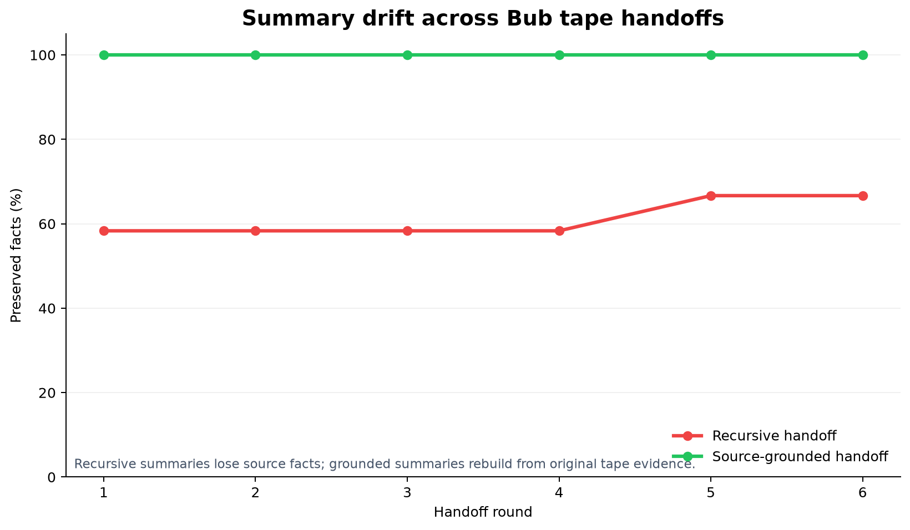

# Bub Tape Summary-Drift Demo

A reproducible experiment that uses [Bub](https://github.com/bubbuild/bub)'s real append-only `Tape`, `TapeEntry`, `FileTapeStore`, anchors, and handoffs to measure how repeated summaries lose meaning.



The experiment compares:

1. **Recursive handoff** — each round summarizes only the previous summary plus the latest update. Once a fact is omitted, it cannot return. This is the common summary-of-summary failure mode.
2. **Source-grounded handoff** — each round regenerates the handoff from the original atomic facts plus all updates, with source IDs.

Both strategies write the same updates to separate Bub tapes. An LLM judge grades every handoff against the original facts, while a transparent keyword metric provides a deterministic baseline.

## What this tests

The included Atlas migration scenario has 12 atomic facts designed to expose common drift:

- exact dates, quantities, and latency bounds
- negation and restricted exceptions
- provisional versus final decisions
- rollback conditions
- owner versus approver roles
- retention versus deletion periods
- narrow scope and verification criteria

The demo reports per-round:

- **semantic recall** — facts materially preserved, as judged against atomic sources
- **exact-key recall** — facts retaining all configured key phrases
- contradictions
- unsupported claims
- summary size

## Install

Requirements: Python 3.12+, `uv`, and credentials for any model supported by Bub's `any-llm` stack.

```bash
git clone https://github.com/bubbuild/bub.git  # only needed if you want to inspect Bub
cd tape-summary-drift-demo
uv sync --dev
```

The project installs Bub from its GitHub repository. To use a local checkout while developing:

```bash
uv add --editable ../bub
```

Set credentials using Bub conventions. For example:

```bash
export BUB_OPENAI_API_KEY='...'
# or use a generic OpenAI-compatible endpoint:
export BUB_API_KEY='...'
export BUB_API_BASE='https://your-endpoint/v1'
```

Do not commit credentials.

## Run

```bash
uv run tape-drift run \
  --model openai:gpt-4.1-mini \
  --judge-model openai:gpt-4.1-mini \
  --rounds 6
```

For stronger evaluation, use a different or stronger judge model:

```bash
uv run tape-drift run \
  --model anthropic:claude-3-5-haiku-latest \
  --judge-model openai:gpt-4.1 \
  --rounds 10
```

Outputs:

```text
.demo-tapes/
├── summary_drift__recursive.jsonl
├── summary_drift__grounded.jsonl
├── report.json
└── charts/
    ├── semantic-recall.png
    └── summary-drift-dashboard.png
```

Re-render an existing result without model calls:

```bash
uv run tape-drift report .demo-tapes/report.json
```

Generate charts from any existing report:

```bash
uv run tape-drift visualize \
  sample-results/report.json \
  --output-dir sample-results
```

The dashboard combines semantic recall, exact-key detail retention, and per-fact final status. The compact chart is sized for README and chat previews.

Run tests and lint:

```bash
uv run pytest
uv run ruff check .
```

## Expected interpretation

A typical run should show recursive semantic recall trending downward or accumulating contradictions, while source-grounded recall remains higher. Exact values vary by model and are not guaranteed—variance is part of what this experiment measures.

A checked-in `sample-results/` run using `gpt-5.4-mini` as summarizer and `gpt-5.4` as judge is included. Across six rounds, recursive handoffs preserved **58–67% semantic recall** and **25–42% exact-key recall**; source-grounded handoffs preserved **100% semantic recall** and **75–100% exact-key recall**. The recursive final handoff missed F01, F05, F08, and F10. This is one run, not a statistically stable benchmark.

A result does **not** prove that Tape itself causes drift. It demonstrates that:

- append-only storage preserves the original evidence;
- the context view after an anchor may still be lossy;
- recursive handoffs amplify omissions;
- source-grounded reconstruction can recover evidence because the tape retained it.

Run several repetitions and compare distributions before drawing conclusions.

## Inspecting the Bub mechanics

Each strategy uses:

```python
FileTapeStore(...)           # append-only JSONL backend
TapeEntry.message(...)       # phase updates
Tape.handoff(...)            # anchor + handoff event
TapeEntry.event(...)         # source facts and drift grades
```

The raw tape contains source facts, all updates, every anchor, and all grades even though the active post-anchor context is bounded. This distinction—**history versus assembled view**—is the core of the test.

## Extending the demo

Useful next experiments:

- compare free-form versus typed anchor schemas;
- vary compression budgets;
- add whole-tape retrieval before recursive handoffs;
- inject contradictions and measure stale-fact selection;
- compare models and temperatures across repeated runs;
- replace `FileTapeStore` with Bub's SQLAlchemy/SQLite-vector plugins;
- add a human-blind judge or task-level downstream test.

## Limitations

- LLM judging can be biased or noisy; the deterministic metric is intentionally conservative but shallow.
- A single synthetic scenario is not representative of all agent work.
- The demo measures summary retention, not overall application quality.
- Model APIs can change and stochastic outputs vary.
- Bub's JSONL store is a local reference backend, not a distributed multi-writer log.
